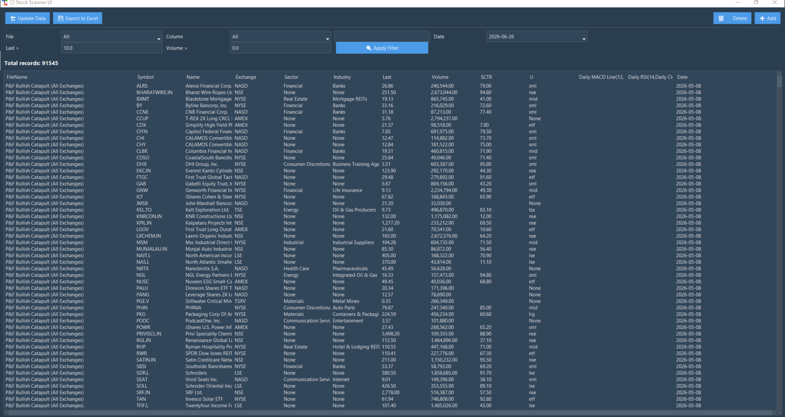
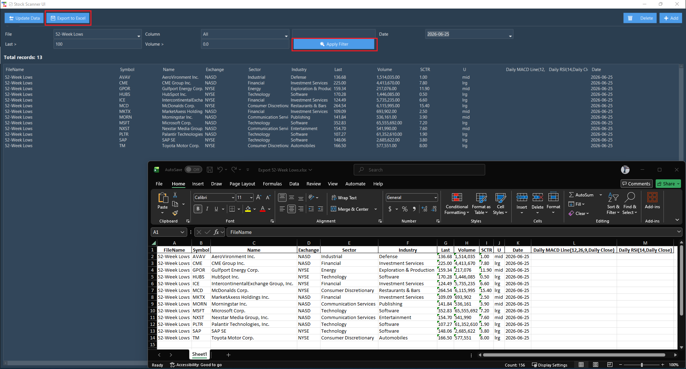

# Auto Stock Scanner

A professional desktop application for scanning and analyzing stock market data. The app fetches stock data from multiple sources, stores results in a local SQLite database, and provides an intuitive interface for filtering, sorting, and exporting analysis.

## About
This project demonstrates full-stack desktop app development—from data fetching and database management to UI design and Windows packaging. Built with a focus on code organization, error handling, and user experience.

## Features
- **Data Fetching**: Automatically download and merge latest stock scan data from GitHub
- **Database Management**: Local SQLite storage with incremental updates and deletion tracking
- **Advanced Filtering**: Filter by file, date, column search, price range, and volume thresholds
- **Sorting & Ranking**: Sort by any column with dynamic indicators
- **Excel Export**: Export filtered results with formatted numbers
- **Settings Persistence**: Automatically save column widths, window size, and filter preferences
- **Desktop Packaging**: Builds to a standalone Windows `.exe` with PyInstaller

## Technology Stack
- **UI Framework**: Tkinter with ttkbootstrap (modern theming)
- **Data Processing**: Pandas for manipulation and analysis
- **Database**: SQLite3 for persistent local storage
- **Web Scraping**: BeautifulSoup & Requests for data fetching
- **Packaging**: PyInstaller for Windows desktop distribution
- **Language**: Python 3.13+

## Requirements
```bash
pip install pandas requests beautifulsoup4 ttkbootstrap
```

## Quick Start

### Run locally
```bash
python app_github.py
```

### Build Windows EXE
```bash
python -m PyInstaller --onefile -w app_github.py
# Output: dist/app_github.exe
```

## Screenshots





## Project Structure
- `app_github.py` — Main application entry point (UI + logic)
- `fetch_data.py` — Data fetching and merging utilities
- `APP_GITHUB_ARCHITECTURE.md` — Detailed system design and API documentation
- `.github/workflows/` — GitHub Actions for automated database updates

## Key Implementation Details
- **Incremental Updates**: Only new records are merged, avoiding duplicates
- **Deleted Records Tracking**: Maintains a history of deleted rows to prevent re-importing
- **Runtime Data Persistence**: Database files are written next to the executable, not in temp folders
- **Error Handling**: Comprehensive try-catch with user-friendly error dialogs
- **Dynamic Schema**: Automatically adds columns as new data arrives

## License
MIT
